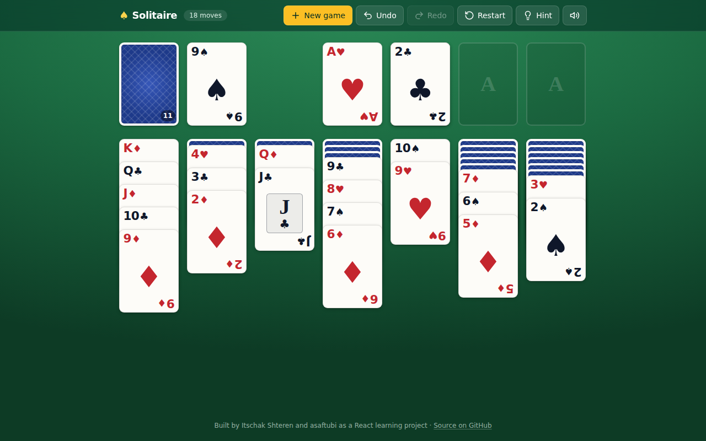

# Solitaire

A browser version of classic **Klondike solitaire**, built with React and Vite
in the summer of 2024 as a two-person learning project and polished up in 2026.
The interesting part is the game model: the rules, the deal and a full move
history (undo, redo, restart) are plain JavaScript classes that the React
components render.

**[▶ Play it live](https://itschakasafreactproject.netlify.app/)**



## Features

- **Klondike rules**: seven tableau columns dealt 1 to 7, four foundations,
  and a 24-card stock you turn one card at a time and turn back over when it
  runs out.
- **Click (or tap) to move**: click a face-up card and it moves, together with
  any cards stacked on it, to the first legal destination: a foundation if one
  accepts it, otherwise the leftmost tableau column that does (alternating
  colours, descending rank; only a King may fill an empty column).
- **Drag and drop** on desktop: drag a card or a run onto the column or
  foundation you choose. Illegal drops are ignored.
- **Hint**: highlights a useful move and where it goes, or the stock when
  drawing is the only option.
- **Undo, redo and restart**: every move is an immutable `GameState` snapshot
  in a `Game` history object, so you can step back and forward through the
  game or return to the original deal.
- **New game**: shuffles through the public
  [Deck of Cards API](https://deckofcardsapi.com/), with a local shuffle as a
  fallback if the API is unreachable.
- **Auto-finish**: once every tableau card is face up, an Auto-finish button
  plays the remaining moves (drawing from the stock when needed) one by one.
  It only appears when a simulated run proves the game can be finished.
- **Sound** (with a mute toggle that is remembered per browser), a move
  counter, and a short GSAP animation when you win.
- **Responsive**: card size follows the screen, from desktop down to a 390px
  phone, and long columns are squeezed to fit.

## Controls

| Control | What it does |
| --- | --- |
| Click / tap a face-up card | Move it (and the cards on it) to the first legal spot |
| Drag a card (desktop) | Drop it on a specific column or foundation |
| Click the stock | Turn over the next card; when empty, turn the waste back over |
| New game / Undo / Redo / Restart | As named; Restart returns to the original deal |
| Hint | Highlight a suggested move |
| Speaker icon | Mute or unmute sound |
| Tab + Enter | Keyboard players can focus a face-up card and press Enter to move it |

## Tech stack

- **React 18** and **Vite 5**
- **Tailwind CSS** for all styling; cards are drawn with CSS
- **Generated SVG backgrounds**: a new futuristic backdrop for every game, drawn in the
  browser from a seed, so nothing has to download
- **react-dnd** (HTML5 backend) for drag and drop
- **GSAP** for the invalid-move shake (the whole stack shakes) and the win animation
- **react-icons** for the toolbar icons
- **Deck of Cards API** for shuffling

## How it is organised

```
src/
  App.jsx                    top bar + board + footer
  components/Header.jsx      top bar: new game, undo, redo, restart, hint, sound
  components/sound.js        sound effects (Web Audio, preloaded so they play instantly)
  components/Backdrop.jsx    the generated SVG background
  components/game/
    useSolitaire.js          game state hook: deal, moves, history, hint, sound
    Logic.js                 move rules (tableau and foundation validity)
    moves.js                 pure helpers: legal targets, apply a move, find a hint
    OurStack.js              a pile of cards with a face-up count
    GameState.js             immutable snapshot of tableau, foundations, stock; win check
    Game.js                  move history with undo / redo / reset
    Solitaire.jsx            the board and its responsive card sizing
    Card.jsx, Jackpot.jsx,   card, stock/waste, foundation and tableau views
    FinalStack.jsx, GameStack.jsx
    WinOverlay.jsx           the "You won!" dialog and the card-scatter celebration
public/
  images/                    empty-pile art
  sounds/                    sound effects
```

## Running it locally

Requires Node.js 18+.

```bash
npm install
npm run dev        # http://localhost:5173
npm run lint
npm run build      # production build in dist/
npm run preview    # serve the production build
```

## Known limitations

- **Drag and drop is desktop only.** react-dnd's HTML5 backend does not handle
  touch events, so on phones and tablets you play by tapping (click-to-move),
  which picks the first legal destination for you. While dragging a run, the
  drag preview shows only the card you picked up.
- **Draw-one only**: there is no draw-three mode and no scoring or timer.
- **The hint is a simple heuristic** (foundation moves first, then moves that
  reveal a face-down card, then the waste card, then "draw"). It does not look
  ahead, and once the stock has been cycled it can keep suggesting a draw.
- **The game is not saved**: reloading the page deals a new game.

## Credits

Built together with Asaf Tubi (commits by `asaftubi`). Shuffling comes from
the [Deck of Cards API](https://deckofcardsapi.com/).
