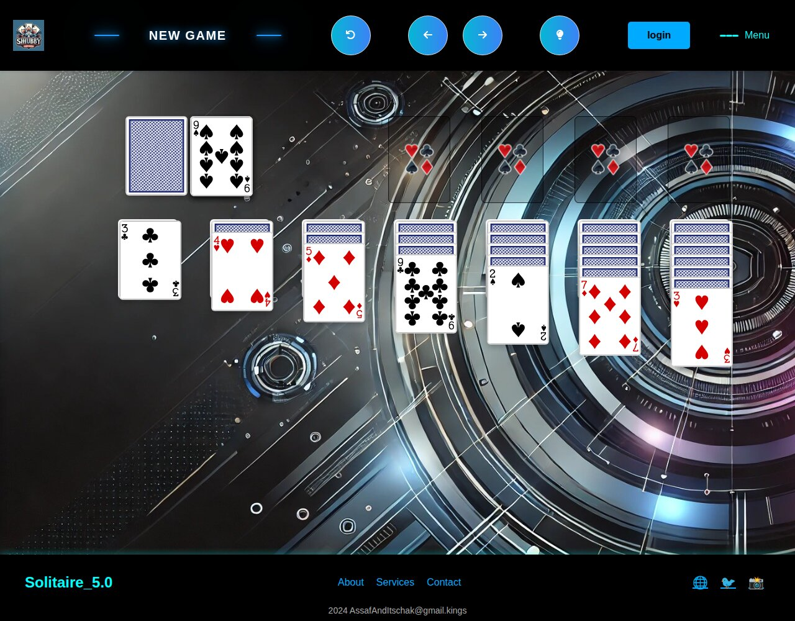

# Solitaire

A browser version of classic **Klondike solitaire**, built with React and Vite
in the summer of 2024 as a two-person learning project. The interesting part
is the game model: the rules, the deal and a full move history (undo, redo,
restart) are plain JavaScript classes that the React components render.



## Features

- **Klondike rules** — seven tableau columns dealt 1 to 7, four foundation
  piles, and a 24-card stock you flip one card at a time and redeal when empty.
- **Click-to-move** — click a face-up card and it moves (together with any
  cards stacked on it) to a legal destination: a foundation if one accepts it,
  otherwise a tableau column (alternating colours, descending rank; only a
  King may fill an empty column).
- **Undo, redo and restart** — every move is stored as an immutable
  `GameState` snapshot in a `Game` history object, so the arrow buttons step
  back and forward through the game and the restart button returns to the
  original deal.
- **New game** — fetches a freshly shuffled deck from the public
  [Deck of Cards API](https://deckofcardsapi.com/) and rotates through ten
  background images.
- **Sound and animation** — a click sound when you pick a card, a win sound,
  and a GSAP animation that scatters the cards across the table when all four
  foundations are complete.

## Tech stack

- **React 18** with Context for shared game state, **Vite 5** for dev/build
- **Tailwind CSS** and **Bootstrap 5** for layout, **styled-components** for
  the header, footer and menu
- **GSAP** for the card and win animations, **p5.sound** for audio
- **react-dnd** set up for dragging cards (see *Known limitations*)
- **Deck of Cards API** for shuffling and card images

## How it is organised

```
src/
  App.jsx                    GameContext provider (deck, selection, history, background)
  pages/Home.jsx             header + board + footer
  components/Header.jsx      new game / restart / undo / redo controls
  components/game/
    Solitaire.jsx            deals the deck, resolves each click into a move
    Logic.js                 move rules (tableau and foundation validity)
    OurStack.js              a pile of cards with a face-up count
    GameState.js             immutable snapshot of tableau, foundations, stock; win check
    Game.js                  move history with undo / redo / reset
    Card.jsx, Jackpot.jsx,   card, stock/waste, foundation and tableau views
    FinalStack.jsx, GameStack.jsx
public/
  images/backGrounds/        the ten table backgrounds
  sounds/                    sound effects
```

## Running it locally

Requires Node.js 18+ and an internet connection (the deck, card images,
Bootstrap and p5 load from public CDNs and APIs).

```bash
npm install
npm run dev        # http://localhost:5173
npm run build      # production build in dist/
npm run preview    # serve the production build
```

## Known limitations

This is a 2024 learning project and is kept roughly as it was; the main rough
edges are:

- **Moves are click-based.** Cards are draggable through react-dnd, but no
  drop targets were wired up, so dropping a card does nothing.
- **When several moves are legal, the destination is picked at random**
  rather than chosen by the player.
- **The lightbulb (hint) button, login form and side menu are placeholders.**
- **Sound paths start with `/public/`**, which works under `npm run dev` but
  not in a production build, where the files are served from `/sounds/`.
- **Desktop only:** the board has a fixed 1200px width.
- A few dependencies in `package.json` (Leaflet, Redux, framer-motion and
  others) are left over from earlier course exercises and are not used.

## Credits

Built together with a classmate (commits by `asaftubi`). Deck shuffling and
card images come from the [Deck of Cards API](https://deckofcardsapi.com/).
